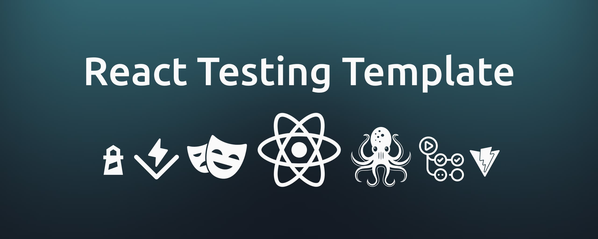

# React Testing Template

This is a simple template for adding testing to your Vite-powered React Applications. the included test tools are as follows

- [Vitest + Testing Library](#vitest--testing-library): For unit and integration testing.
- [Playwright](#playwright): For E2E and Cross browser testing.

## Vitest & Testing Library

### Installation

> [!IMPORTANT]
> The following command is using PNPM, please make sure your project manager is set to PNPM, otherwise modify the commands to use NPM.

```bash
pnpm add -D vitest jsdom @testing-library/jest-dom @testing-library/react
```

Afterwards, create the following file in the given directory:

```typescript
/** File location: src/__test__/setup.ts */
import "@testing-library/jest-dom";
```

Then modify your `vite.config.ts` to resemble the following code snippet:

```typescript
/// <reference types="vitest" />
/// <reference types="vite/client" />

import { defineConfig } from "vite";
import react from "@vitejs/plugin-react-swc";

// https://vitejs.dev/config/
export default defineConfig({
  plugins: [react()],
  test: {
    globals: true,
    environment: "jsdom",
    setupFiles: "./src/__test__/setup.ts",
    css: true,
    reporters: ["default", "json"],
    outputFile: "./reports/test-summery.json",

    // Limiting the scope of Vitest to `src` directory
    include: ["src/**/*.spec.tsx"],

    coverage: {
      provider: "v8",
      include: ["src/**/*"],
      reporter: ["text", "json-summary"],
      reportsDirectory: "./reports/",
    },
  },
});
```

Lastly, add the three following commands to your `package.json`

```json
{
  "scripts": {
    "test": "vitest run",
    "test:watch": "vitest",
    "test:coverage": "vitest run --coverage"
  }
}
```

### Usage

Here is how to use each of the added commands

| Command | Goal |
| --- | --- |
| `test` | Only executes the tests once |
| `test:watch` | Executes the tests on each file changes |
| `test:coverage` | Executes all of the tests and generates the coverage report |

Also keep in mind the `test` and `test:coverage` commands will output a test result in the `reports` directory. You can modify these outputs by updating the reporter in the `vite.config.ts` file.

### Automation

The `coverage` test and the `vitest` tests can be executed upon `push` and `pull` requests with the GitHub actions. You can find an example of this sort of automation within the following files:

- [`vitest-coverage.yml`](./.github/workflows/vitest-coverage.yml)
- [`vitest-test.yml`](./.github/workflows/vitest-test.yml)

keep in mind that incase you want to copy these automation scripts, you also have to copy the content of the [`./scripts`](./scripts/) into your projects. The included files will generate a summary of each action run and also output a notice after action completion.

## Playwright

### Installation

> [!IMPORTANT] 
> The following command is using PNPM, please make sure your project manager is set to PNPM, otherwise modify the commands to use NPM.

Run the following command and complete the process with the setup wizard.

```bash
pnpm create playwright
```

Then update your `playwright.config.ts` to include the following configurations:

```typescript
import { defineConfig, devices } from "@playwright/test";

/**
 * See https://playwright.dev/docs/test-configuration.
 */
export default defineConfig({
  // ... //
  reporter: process.env.CI ? "github" : "list",
  // ... //
  use: {
    baseURL: "http://localhost:4173",
    trace: "on-first-retry",
  },
  // ... //
  webServer: {
    command: "pnpm run preview",
    url: "http://localhost:4173",
    reuseExistingServer: !process.env.CI,
  },
  // ... //
});
```

Lastly, check your `package.json` to see if the following script has been added to it, otherwise add it manually

```json
{
  "scripts": {
    "test:e2e": "playwright test"
  }
}
```

### Usage

> [!CAUTION]
> Since you need to download some additional binaries to execute these tests, personally, I don't recommend running these tests on your system, at least set up a VM to execute them.

Here is how to use the added command

| Command    | Goal                   |
| ---------- | ---------------------- |
| `test:e2e` | Executes the e2e tests |

> [!NOTICE]
> You need to run the following commands before being able to run the test command:
>
> 1. Installing additional Playwright dependencies:
>
>    ```bash
>    pnpm exec playwright install --with-deps
>    ```
>
> 2. Building the application:
>
>    ```bash
>    pnpm run build
>    ```
>
> 3. Executing the Tests:
>
>    ```bash
>    pnpm run test:e2e
>    ```

### Automation

In case you have selected the option of GitHub Actions in the wizard process, you most likely have a `playwright.yml` file inside your workflows directory. We just need to update it with an additional step to build the application before running the tests.

```diff yml
name: Playwright Tests

on:
  push:
    branches: [main]
  pull_request:
    branches: [main]

jobs:
  test:
    timeout-minutes: 60
    runs-on: ubuntu-latest

    steps:
      - uses: actions/checkout@v3

      - uses: actions/setup-node@v3
        with:
          node-version: 20

      - name: Install dependencies
        run: npm install -g pnpm && pnpm install

+     - name: Building the React application
+       run: pnpm run build

      - name: Install Playwright Browsers
        run: pnpm exec playwright install --with-deps

      - name: Run Playwright tests
        run: pnpm exec playwright test

      - uses: actions/upload-artifact@v3
        if: always()
        with:
          name: playwright-report
          path: playwright-report/
          retention-days: 10

```
